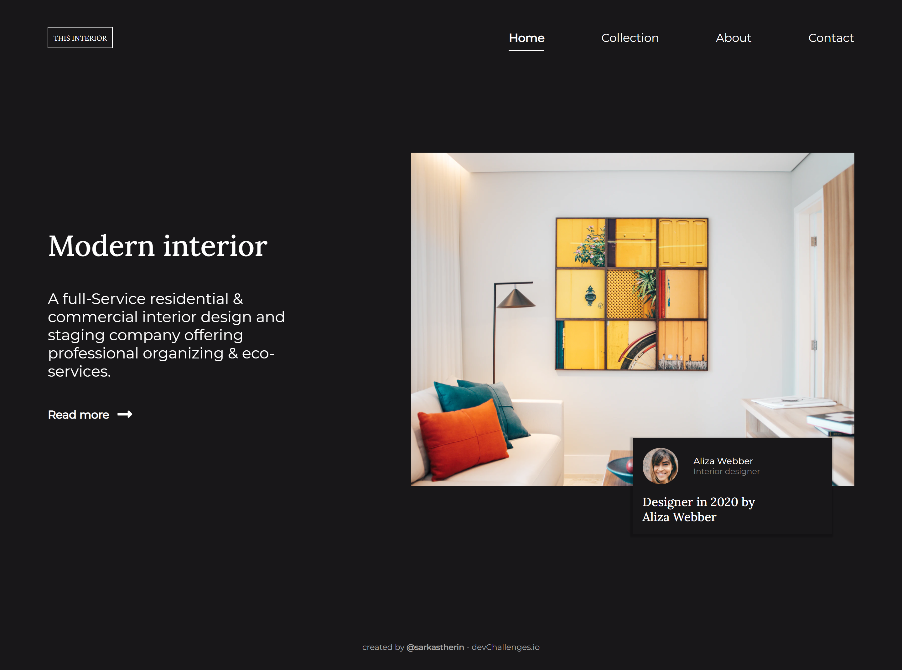

<!-- Please update value in the {}  -->

<h1 align="center">Modern interior</h1>

   Solution for a challenge from  <a href="http://devchallenges.io" target="_blank">Devchallenges.io</a>.

  <h3>
    <a href="https://{your-demo-link.your-domain}">
      Demo
    </a>
     | 
    <a href="https://{your-url-to-the-solution}">
      Solution
    </a>
     | 
    <a href="https://devchallenges.io/challenges/Jymh2b2FyebRTUljkNcb">
      Challenge
    </a>
  </h3>

<!-- TABLE OF CONTENTS -->

## Table of Contents

- [Overview](#overview)
  - [Built With](#built-with)
- [Features](#features)
- [Contact](#contact)
- [Acknowledgements](#acknowledgements)

<!-- OVERVIEW -->

## Overview

In this project, I used HTML, CSS and Javascript. Is a page with a responsive design, and in the mobile version its menu is hidden and is shown when a button is clicked.   When the menu is displayed fills the entire screen.
I enjoyed do this project. I practiced how I can organize the HTML content  in different screen sizes, also, learned more about responsive font-size and how I can used it in a same sheetstyle and screen (CSS). I coud played with de javascript file, I really enjoy doing code. This is a solution that I can reuse and it is now in my portafolio

### Built With

<!-- This section should list any major frameworks that you built your project using. Here are a few examples.-->

- [HTML]()
- [CSS]()
- [Javascript]()

## Features

<!-- List the features of your application or follow the template. Don't share the figma file here :) -->

This application/site was created as a submission to a [DevChallenges](https://devchallenges.io/challenges) challenge. The [challenge](https://devchallenges.io/challenges/Jymh2b2FyebRTUljkNcb) was to build an application to complete the given user stories.

## Acknowledgements

<!-- This section should list any articles or add-ons/plugins that helps you to complete the project. This is optional but it will help you in the future. For exmpale -->

- [CSS arismético: exprimiendo calc()](https://octuweb.com/css-aritmetico-exprimiendo-calc/)
- [Font Aweson](https://fontawesome.com/)
- [Google Fonts](https://fonts.google.com/)

## Contact

- GitHub [@sarkastherin](https://github.com/Sarkastherin)
- Twitter [@sarkastherin](https://twitter.com/SarKastherin)
